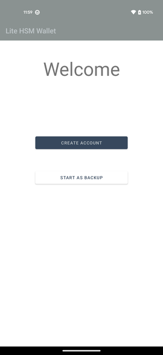
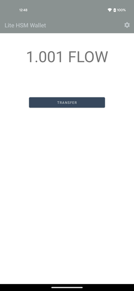
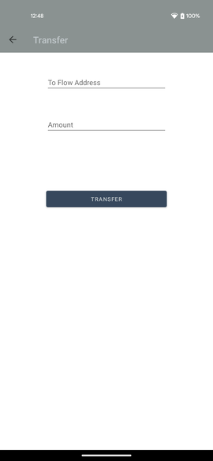
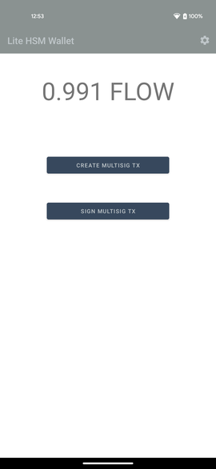
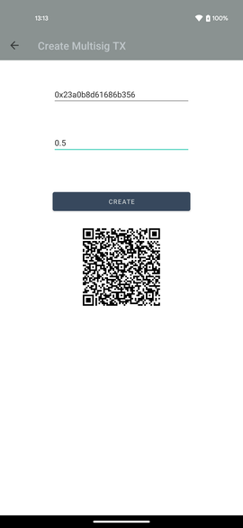
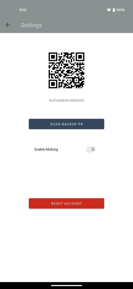
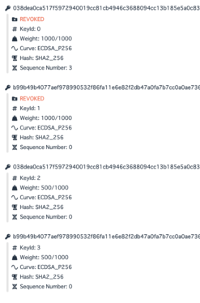

# Lite HSM Wallet

## Overview
The purpose of this project, `Lite HSM Wallet` is to provide a cost-effective solution for secure private key management in blockchain technology. The target blockchain for this project is the Flow blockchain, and the wallet was created for Android devices. `Lite HSM Wallet` utilizes the nature of Flow account model and it supports both single-sig and multi-sig.

## Background
Since the advent of Bitcoin, secure management of private keys has been a challenge. Cold wallets, such as paper wallets or hardware wallets, are generally considered to be the safest methods, but paper wallets are vulnerable to theft and hardware wallets are at risk of breakdown. While hardware wallets offer a backup feature using mnemonics to avoid the risk of breakdown, there is still a risk of mnemonic theft.

Hardware Security Modules (HSMs) are an effective way to avoid these risks. Typically, HSMs store private keys internally in hardware, and there is no direct access to them from the outside. This means that private keys cannot be stolen, and only users with the appropriate permissions can sign transactions securely.

However, many blockchains, including Bitcoin, use addresses that are derived directly from public keys. In this case, using an HSM without a backup for the private key would be taking a risk of breakdown (which is why hardware wallets offer a backup feature using mnemonics). Therefore, it is necessary to use an address system that is independent of the key pair, and that allows the key pair to be rotated arbitrarily, in order to use an HSM.

## Device
HSMs are generally expensive, so a less expensive system is needed. The system that was chosen for this project is the StrongBox Keymaster that is provided by Android devices. The StrongBox Keymaster provides hardware-based cryptographic functions, and private keys are also managed within the hardware. This means that, like an HSM, there is no external access to the private keys.

## Target Chain
The cryptographic algorithms provided by the StrongBox Keymaster are limited, and only P-256 is provided as an elliptic function. Additionally, SHA-3 is not provided as a hash function. Therefore, a chain that meets these conditions and uses the above-mentioned address system that is independent of the key pair is the Flow blockchain.

## Flow Account Management
Flow manages accounts on-chain. The wallet creates a key pair and creates an account by issuing transactions and calling contracts on-chain to associate the public key with the account. Key rotation is possible by adding or deleting public keys for the account.

Gas fees must be paid when issuing transactions, but the cost is low for wallet creation. The Lite HSM wallet is a good solution for those who want to create a Flow wallet at a low cost while ensuring secure private key management.

## How Lite HSM Wallet works

### Creating an account
1. Click "CREAT ACCOUNT" in the welcome screen of the 1st Android device
1. The device generates keypair inside StrongBox Keymaster
1. Create an transaction with the Public Key, let the backend to sign it and broadcast it to the chain

### Adding a backup
1. "START AS BACKUP" in the welcome screen of the 2nd Android device
1. Scan QR code in the setting screen of the 1st device. The QR code represents account information like 0x prefixed address.
1. The 2nd device generates keypair inside StrongBox Keymaster. The Public Key is displayed as a QR code
1. Scan the QR code on the 2nd device by the 1st device. The 1st device creates an transaction which adds the 2nd Public Key

### Switching to multi-sig
1. Open setting screen
1. Turn on "Enable Multisig"
1. A transaction is created which revokes current keys and adds same keys with weight == 500.0

### Transfering FLOW token with single-sig
1. Tap "TRANSFER" in the home screen
1. Input "To Flow Address" and "Amount"
1. Tap "TRANSFER"

### Transfering FLOW token with multi-sig
1. Tap "CREATE MULTISIG TX" in the home screen of the 1st device
1. Input "To Flow Address" and "Amount"
1. Tap "CREATE" button and a QR code is shown
1. Tap "SIGN MULTISIG TX" in the home screen of the 2nd device
1. Scan the QR code on the 1st device by the 2nd device
1. Tap "SIGN AND TRANSFER" on the 2nd device

### Receiving FLOW token
1. Tap balance and a QR code which represents 0x prefixed address is shown.

## Screenshots

### welcome screen
 

### single-sig home screen
 

### single-sig transfer screen
 

### multi-sig home screen
 

### multi-sig transfer screen
 

### settings screen
 

## Sample of how key is managed
Following image shows 2 single-sig keys are revoked and 2 multi-sig keys are created.

 